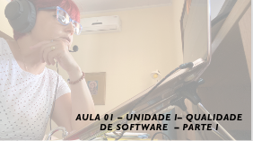
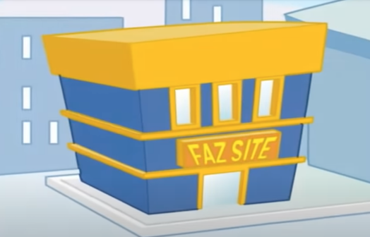

# Gerência e Qualidade de Software
## Tema aula - Unidade I - Qualidade de Software - Parte I
 
>  * Apresentação da Disciplina e plano de ensino / Principais Conceitos sobre qualidade de software

## Atividades da aula - Plano de ensino, principais conceitos e histórico sobre qualidade

## Instalação da Disciplina

### Materiais
- [Slides aula 01](aula2_UnidadeI_Qualidade_sw_parteII.pdf)
- [Mercado Brasileiro de Software](mercado_brasileiro_sw_2021.pdf)

### Videos aulas gerência e qualidade de software -  Qualidade de Software - Parte I

####  O vídeo abaixo mostra como a falta de gerência de qualidade pode provocar problemas no desenvolvimento de sw

### Desenvolvimento aula 01: 

- [ ]  Apresentação Plano de ensino
- [ ]  Conceitos iniciais sobre qualidade
- [ ]  Histórico e necessidade de estudar qualidade de software
- [ ]  Panorama do mercado de desenvolvimento de software (2020)
- [ ]  Realidade dos projetos de software
- [ ]  Vídeo FazSite
