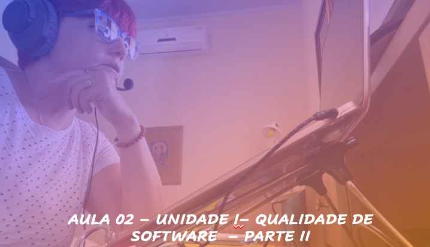
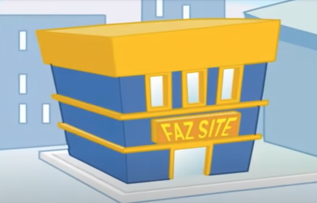

# Aula 02 - Gerência e Qualidade de Software
## Tema aula - Unidade I - Qualidade de Software - Parte II
 
>  *  Conceitos sobre qualidade de software / Visões de Qualidade / Diferença entre Controle de Qualidade e Garantia de Qualidade

## Atividades da aula - Plano de ensino, principais conceitos e histórico sobre qualidade

## Instalação da Disciplina

### Materiais

- [Slides aula 01](aula2_UnidadeI_Qualidade_sw_parteII.pdf)

### Videos aulas gerência e qualidade de software -  Qualidade de Software - Parte I

####  O vídeo abaixo mostra como uma falha numérica pode causar desastres

####  Atividade frequência para quem não participou da aula síncrona - Prazo 03/11/2021

- [Atividade](https://forms.gle/t19CY74Aw3mmy1Aa9)

### Desenvolvimento aula 01: 

- [ ]  Apresentação Plano de ensino
- [ ]  Conceitos iniciais sobre qualidade
- [ ]  Histórico e necessidade de estudar qualidade de software
- [ ]  Panorama do mercado de desenvolvimento de software (2020)
- [ ]  Realidade dos projetos de software
