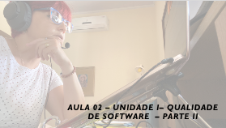
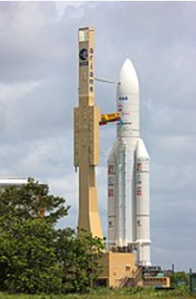

# Aula 02 - Gerência e Qualidade de Software
## Tema aula - Unidade I - Qualidade de Software - Parte II
 
>  *  Conceitos sobre qualidade de software / Visões de Qualidade / Diferença entre Controle de Qualidade e Garantia de Qualidade

## Atividades da aula - Conceitos Qualidade / Gastos com falta de qualidade / Garantia x controle de qualidade / ClassCraft

## Instalação da Disciplina

### Materiais

- [Slides aula 01](aula2_UnidadeI_Qualidade_sw_parteII.pdf)

### Videos aulas gerência e qualidade de software -  Qualidade de Software - Parte I

####  O vídeo abaixo mostra como uma falhas numéricas podem causar desastres

### Desenvolvimento aula 02: 

- [ ]  Apresentação conceitos Qualidade - Parte 2
- [ ]  Discussão sobre problemas e gastos em bilhões
- [ ]  Diferença entre controle de qualidade e garantia de qualidade
- [ ]  Explicação ClassCraft / Completar cadastro alunos
