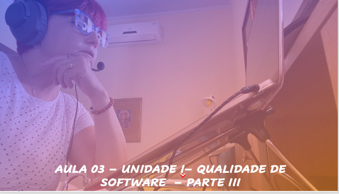
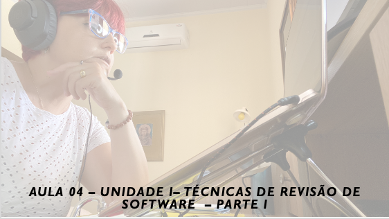
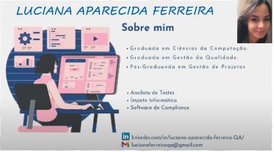

# Gerência e Qualidade de Software
## Tema aula - Unidade I - Dimensões da Qualidade de Software e Técnicas de Revisão Parte I
 
>  *  Dimensões de Qualidade / Qualidade do Produto x Qualidade do Processo / O Dilema da Qualidade de Software / Custos de Prevenção, Avaliação e Falhas / 
>  *  Impacto de defeitos de software nos custos, amplificação e eliminação de defeitos, métricas de revisão e seu emprego

### Materiais

- [Slides aula 03](Aula3_Dimensoes_Qualidade_TecnicasRevisao.pdf)

### Video aula gerência e qualidade de software -  Qualidade de Software - Parte III

### Video aula gerência e qualidade de software -  Técnicas de Revisão - Parte I

### Palestra Luciana Aparecida Ferreira - A importância da Gestão de Qualidade 

### Desenvolvimento aula 03: 

- [ ]  Apresentação das dimensões de Qualidade (Correção, Confiabilidade, Eficiência, Integridade, Usabilidade, Facilidade de Manutenção, Flexibilidade, Testabilidade, Portabilidade, Reusabilidade, Interoperabilidade
- [ ]  Qualidade do Processo x Qualidade do produto (discussão sobre a importância da qualidade do processo para obtenção de um produto de qualidade)
- [ ]  O Dilema da qualidade de software - Software bom o suficente
- [ ]  Discutir sobre a importância das técnicas de revisão como um filtro para eliminação de defeitos
