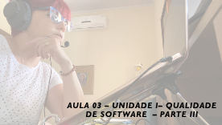

# Gerência e Qualidade de Software
## Tema aula - Unidade I - Qualidade de Software - Parte III
 
>  *  Dimensões de Qualidade / Qualidade do Produto x Qualidade do Processo / O Dilema da Qualidade de Software / Custos de Prevenção, Avaliação e Falhas / Questões extras - para N1

## Atividades da aula - Discutir sobre as dimensões de Qualidade / Trabalhar o equilíbrio entre qualidade do produto e qualidade do processo / Software bom o suficente é passível de entrega / Conversar sobre os custos de Prevenção, Avaliação e Falhas

## Instalação da Disciplina

### Materiais

- [Slides aula 03](documentos/aula3_UnidadeI_Qualidade_sw_parteIII.pdf)

### Video aula gerência e qualidade de software -  Qualidade de Software - Parte III

### Palestra Luciana Aparecida Ferreira - A importância da Gestão de Qualidade 

### Desenvolvimento aula 03: 

- [ ]  Apresentação das dimensões de Qualidade (Correção, Confiabilidade, Eficiência, Integridade, Usabilidade, Facilidade de Manutenção, Flexibilidade, Testabilidade, Portabilidade, Reusabilidade, Interoperabilidade
- [ ]  Qualidade do Processo x Qualidade do produto (discussão sobre a importância da qualidade do processo para obtenção de um produto de qualidade)
- [ ]  O Dilema da qualidade de software - Software bom o suficente
- [ ]  Questões SIGAA - Valendo 10% N1
- [ ]  Missões ClassCraft - Kahoot Qualidade presencial
