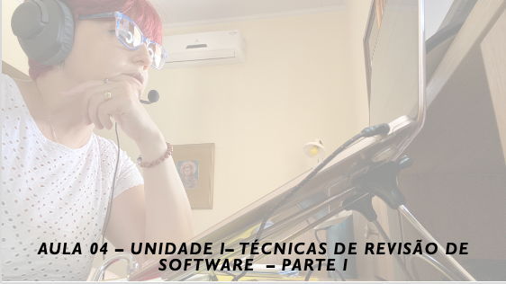

# Aula 04 - Gerência e Qualidade de Software
## Tema aula - Unidade I - Técnicas de Revisão - Parte I
 
>  *  Impacto de defeitos de software nos custos, amplificação e eliminação de defeitos, métricas de revisão e seu emprego

## Atividades da aula - Discutir sobre a importância das técnicas de revisão como um filtro para eliminação de defeitos

## Instalação da Disciplina

### Materiais

- [Slides aula 04](aula4_UnidadeI_Tecnicas_de_revisao_parteI.pdf)

### Video aula gerência e qualidade de software -  Qualidade de Software - Parte III

####  Atividade frequência para quem não participou da aula síncrona - Prazo 16/11/2021

- [Atividade]()

### Desenvolvimento aula 01: 

- [ ]  Discutir sobre a importância das técnicas de revisão como um filtro para eliminação de defeitos
- [ ]  Apresentar o Exemplo de amplificação de defeitos sem o emprego de revisão e com o emprego de revisão
- [ ]  Apresentar as métricas de revisão Ep (esforço de preparação), Ea (Esforco de Avaliação) , Re (Reformulação de Esforço) e também TAS (Tamanho do Artefato de Software),  Errsec(Erros secundários) e Errgraves (Erros graves) 
- [ ]  Mostar a Aplicação Projeto Conexão do Saber
- [ ]  Fazer kahoot Qualidade de Software completo valendo + 10XP para cada questão correta / -10XP para cada questão incorreta, Primeiro lugar + 300 XP, Segundo lugar +200 XP, Terceiro lugar +100 XP
