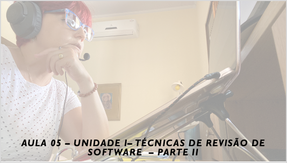

# Gerência e Qualidade de Software
## Tema aula - Unidade I - Técnicas de Revisão - Parte II
 
>  *  Formalidade em técnicas de revisão; Revisão informal

## Atividades da aula - Discutir sobre as técnicas de revisões formais e informais

### Materiais

- [Slides aula 04](Aula4_TecnicasRevisao_ParteII.pdf)

### Video aula gerência e qualidade de software -  Qualidade de Software - Parte III

### Desenvolvimento aula: 

- [ ]  Discutir sobre o aspecto de formalidade das técnicas de revisão
- [ ]  Uma revisão informal, como programação em pares, pode revelar problemas e não deve ser descartado
- [ ]  Apresentar os indivíduos envolvidos em um processo de revisão formal
- [ ]  Apresentar diretrizes de uma revisão formal
- [ ]  kahoot
