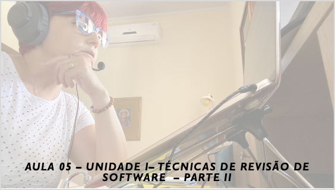

# Aula 05 - Gerência e Qualidade de Software
## Tema aula - Unidade I - Técnicas de Revisão - Parte II
 
>  *  Impacto de defeitos de software nos custos, amplificação e eliminação de defeitos, métricas de revisão e seu emprego

## Atividades da aula - Discutir sobre as técnicas de revisões formais e informais

## Instalação da Disciplina

### Materiais

- [Slides aula 05](aula5_UnidadeI_Tecnicas_de_revisao_parteII.pdf)

### Video aula gerência e qualidade de software -  Qualidade de Software - Parte III

####  Atividade frequência para quem não participou da aula síncrona - Prazo 30/11/2021

- [Atividade](https://forms.gle/LKjuR9qPczqB9yLC6)

### Desenvolvimento aula 05: 

- [ ]  Discutir sobre o aspecto de formalidade das técnicas de revisão
- [ ]  Uma revisão informal, como programação em pares, pode revelar problemas e não deve ser descartado
- [ ]  Apresentar os indivíduos envolvidos em um processo de revisão formal
- [ ]  Apresentar diretrizes de uma revisão formal
- [ ]  Questão a ser desenvolvida como parte da N1
- [ ]  Kahoot Técnicas de Revisão completo valendo + 20XP para cada questão correta / -10XP para cada questão incorreta, Primeiro lugar + 300 XP, Segundo lugar +200 XP, Terceiro lugar +100 XP
