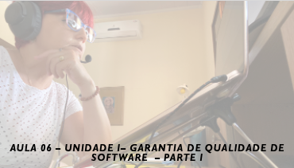

# Aula 06 - Gerência e Qualidade de Software
## Tema aula - Unidade I - Garantia de Qualidade de Software - Parte I
 
>  *  Elementos da garantia de qualidade de software, tarefas SQA ( Software Quality Assurance)

## Atividades da aula - Introdução a Garantia de Qualidade de Software, etapas envolvidas, padrões, diferença entre revisões e auditorias, tarefas da SQA
## Instalação da Disciplina

### Materiais

- [Slides aula 06](aula6_unidadeI_garantia_de_qualidade_de_software_parteI.pdf)

### Video aula gerência e qualidade de software -  Qualidade de Software - Parte III

####  Atividade frequência para quem não participou da aula síncrona - Prazo 08/12/2021

- [Atividade](https://forms.gle/mM2eDEFdGYJ38HPb7)

### Desenvolvimento aula 06: 

- [ ]  Discutir sobre garantia de qualidade de software
- [ ]  O que é, Etapas envolvidas, Por que é importante, Qual é o artefato, Como garantir que o trabalho foi realizado corretamente, Quem realiza
- [ ]  Elementos da garantia de qualidade: Coleta e análise de erros; Gerenciamento de mudanças; educação; Gerência dos fornecedores; 
Administração da segurança; Proteção; Administração de riscos
- [ ]  Tarefas da SQA: Preparar um plano de SQA, Participar no desenvolvimento da descrição de qualidade do projeto; Revisar as atividades de engenharia de 
software para verificar sua conformidade com a gestão de qualidade definida; Auditar produtos de software; Garantir que os desvios sejam documentados e tratados;
Registrar qualquer não aderência e relatar ao gerenciamento superior.
- [ ]  Técnica POMODORO para melhor gerência de tempo.
