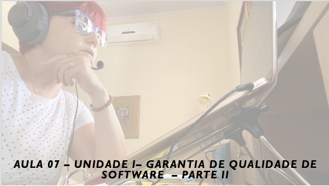

# Aula 07 - Gerência e Qualidade de Software
## Tema aula - Unidade I - Garantia de Qualidade de Software - Parte II
 
>  *  Metas e métricas de SQA, Estatísticas da garantia da qualidade de software, confiabilidade de software e plano de SQA

## Atividades da aula - Apresentar as principais metas e métricas para SQA, o princípio de pareto aplicado a garantia de qualidade de software, seis sigma para engenharia de software.

## Instalação da Disciplina

### Materiais

- [Slides aula 07](aula7_unidadeI_garantia_de_qualidade_de_software_parteII.pdf)

### Video aula gerência e qualidade de software -  Qualidade de Software - Parte III

####  Atividade frequência para quem não participou da aula síncrona - Prazo 15/12/2021

- [Atividade]()

### Desenvolvimento aula 07: 

- [ ] Metas pragmáticas: Qualidade dos requisitos,Qualidade do projeto, Qualidade do código, Eficácia do controle de qualidade
- [ ] Estatísticas da garantia da qualidade de software: O princípio de pareto aplicado a garantia de qualidade de software
- [ ] Vídeo para exemplo do Princípio de Pareto na prática
- [ ] Seis Sigma em engenharia de software DMAAC (Definir, Medir, Analisar, Aperfeiçoar e Controlar)
- [ ] Confiabilidade de software:  “a probabilidade de operação sem falhas de um programa de computador em um dado ambiente por um determinado tempo.”
- [ ] Proteção de Software: examina as maneiras em que as falhas resultam em condições que podem levar a problemas.
- [ ] O plano de SQA
- [ ]  Kahoot Garantia de Qualidade de Software - Parte 2 valendo + 30XP para cada questão correta / -10XP para cada questão incorreta, Primeiro lugar + 500 XP, Segundo lugar +300 XP, Terceiro lugar +200 XP. Assíncrono no seguinte link:
- [Link kahoot assíncrono](https://kahoot.it/challenge/04026898?challenge-id=dd701e52-7000-49c6-a9d2-33d726c8c00f_1638212114800)
- Kahoot termina em: 12/12/2021 às 23h
