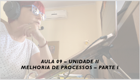

# Aula - Gerência e Qualidade de Software
## Tema aula - Unidade II - Melhoria de Processos de Software - Parte I
 
>  *  O que é SPI (Software Process Improvement) e o processo de SPI.

## Atividades da aula - Apresentar o que é SPI, como melhor implementar o processo de melhoria

## Instalação da Disciplina

### Materiais

- [Slides aula 09](aula9_unidadeII_melhoria_processos_parte1.pdf)

### Video aula gerência e qualidade de software -  Melhoria de processos - Parte 1

### Desenvolvimento aula 09: 

- [ ] O que é SPI
- [ ] Início dos conceitos de modelo de maturidade
- [ ] Níveis CMM
- [ ] O processo SPI
- [ ] Avaliação no processo de SPI
- [ ] KAHOOT PRESENCIAL
