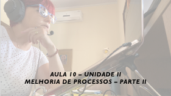

# Gerência e Qualidade de Software
## Tema aula - Unidade II - Melhoria de Processos de Software - Parte II
 
>  * Etapas do processo de melhoria de software: Educação e treinamento, Seleção e Justificação, Instalação/Migração, Mensuração
>  * Fatores críticos de sucesso
>  * Resistência a mudanças e persistência a mudanças
>  * Retorno sobre investimento
>  * Tendências de SPI

## Atividades da aula - Apresentar as etapas de SPI, Os riscos na aplicação de um processo de mudança e tendências da SPI

### Materiais

- [Slides aula 10](aula10_unidadeII_melhoria_processos_parte2.pdf)

### Video aula gerência e qualidade de software -  Melhoria de processos - Parte 2

### Desenvolvimento aula: 

- [ ] Etapas do processo de melhoria de software: Educação e treinamento, Seleção e Justificação, Instalação/Migração, Mensuração
- [ ] Fatores críticos de sucesso
- [ ] Resistência a mudanças e persistência a mudanças
- [ ] Retorno sobre investimento
- [ ] Tendências de SPI
- [ ] Questões AVA -[Atividade 4](https://forms.gle/5LJhVkxunzHPE4PU6)
