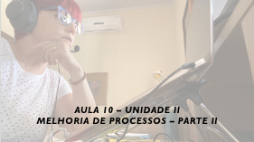
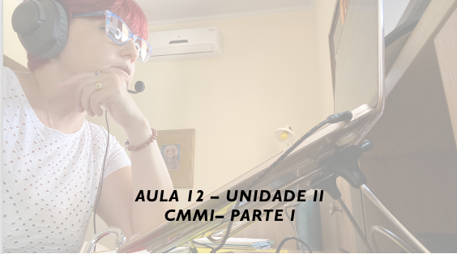
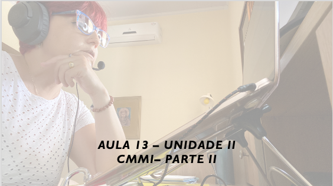

# Aula - Gerência e Qualidade de Software
## Tema aula - Unidade II - Melhoria de Processos, CMMI, MPS.BR
>  *  Nesta aula utilizaremos ClassCraft e Kahoot para revisão de assuntos relacionados a Unidade II

## Atividades da aula - Batalha ClasCraft: Melhoria de Processos e Mps.br / KAHOOT CMMI 2.0

### Materiais
- [Slides aula 10](aula10_unidadeII_melhoria_processos_parte2.pdf)
- [Slides aula 12 ](aula12_unidadeII_cmmi_parte1.pdf)
- [Slides aula 13](aula13_unidadeII_cmmi_parte2.pdf)
- [Slides aula 14](aula14_unidadeII_mpsbr.pdf)

### Video aulas Unidade II

### Desenvolvimento aula: 

- [ ] ClassCraft - Batalha Unidade II
- [ ] Kahoot - CMMI 2.0
