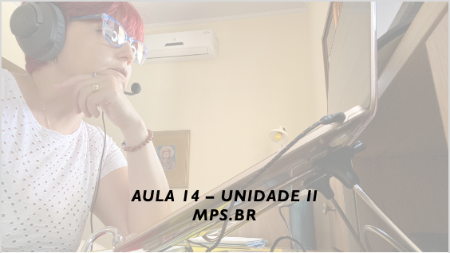

# Aula - Gerência e Qualidade de Software
## Tema aula - Unidade II - MPS.BR
>  *  MPS.BR

## Atividades da aula - Apresentar a estrutura do MPS.BR, motivação, histórico

## Instalação da Disciplina: Evolução do MPS.BR

### Materiais

- [Slides aula 14](aula14_unidadeII_mpsbr.pdf)

### Video aula gerência e qualidade de software -  MPS.BR

### Desenvolvimento aula: 

- [ ] Motivação para a criação do MPS.BR
- [ ] Histórico
- [ ] Estrutura do MPS.BR
- [ ] O Modelo de Referência (MR-MPS)
